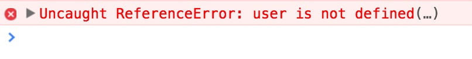

title: Elm
theme: sudodoki/reveal-cleaver-theme
output: slideshow.html

--

# Elm

## FP in your browser
Martin Chabot

@martinosis

--

### How do you feel when you see this ?

--



---

### Do you feel like this?


---

### Or maybe like this?


---

### Imagine a world without runtime exceptions


---


---

### This world exists,  and it's called

---

# Elm

---

### Elm is For creating web browser-based application
- Elm transpiles to Javascript
- In runs in the browser
---

### Elm is a pure functional language

> 1. The function always evaluates the same result value given the same argument value(s).
> 2. Evaluation of the result does not cause any semantically observable side effect or output, such as mutation of mutable objects or output to I/O devices.

---

### Example

A pure function Ruby

```
def add(a, b)
  a + b
end
```

```
add(10, 2)
```
---

Impure function in Ruby

```
user.save
```

---

### Elm is Statically Typed 

Types are infered

---
### NULL  does not exist
---
Tony Hoare, the creator of the NULL reference
>  I couldn't resist the temptation to put in a null reference, simply because it was so easy to implement. 
This has led to innumerable errors, vulnerabilities, and system crashes, which have probably caused a billion dollars of pain and damage in the last forty years.
---

### Elm is an architecture


---

### Sub components


---

### [Time Travelling Debugger](http://debug.elm-lang.org/edit/Mario.elm)
---
## Elm basics

---
## Functions

Defining a function

```
add a b = a + b
```
Calling a function

```
add 1 2
=>  3
```

---

### Type Annotation

```
add: number -> number -> number
add a b = a + b
```
---

### Partial Function Application

```
add: number -> number -> number
add a b = a + b

add 2 3 
=> 5

(add 2)
=> <function> : number -> number

(add 2) 3
=> 5 : number
```

---

### Forward Pipe Operator

```
add 2 3
```

```
3 |> add 2
=> 5 : number
```

```
rect |> move (10, 30) |> scale 2.5 |> rotate (degrees 45)
```

```
rotate (degrees 45) (scale 2.5 (move (10, 30) rect))
```
---
### Lambda

```
add = (\a b -> a + b)
```

Ruby equivalent
```
add = -> (a, b) { a + b }
```
---

## Basic Types

---

### Records


Creation

```
john = {name = "John", age = 33}
```

Access

```
john.age
=> 33 
```
---
#### Transforming a record

```
bob = { john | name = "Bob" }
=> { name = "Bob", age = 33 }
```

---

#### Tagged Union

```
type Bool = True | False
```

```
type Maybe a = Just a | Nothing
```
```
type Maybe Int = Just Int | Nothing
```
--- 

### List

Creating a list

```
[1, 2, 3]
```

Adding an element to a list

```
myList = (0::[1,2,3])
=> [0,1,2,3] : List number
```
---


### Tooling

- Inline Documentation
- [Live Reload](https://github.com/avh4/elm-format)
- [Elm-format](https://github.com/avh4/elm-format)
- [Repl](https://github.com/elm-lang/elm-repl)
- [Package Manager](https://github.com/elm-lang/elm-package#version-rules)
---

### Package manager

- Gives the diff between versions

```
$ elm package diff evancz/elm-svg 1.0.0 2.0.1
```
```
Comparing evancz/elm-svg 1.0.0 to 2.0.1...
This is a MAJOR change.

====== Changes to module Svg - MAJOR ------

    Added:
        node : String -> List Svg.Attribute -> List Svg.Svg -> Svg.Svg
        text' : List Svg.Attribute -> List Svg.Svg -> Svg.Svg

    Removed:
        svgNamespace : Attribute
        svgNode : String -> List Attribute -> List Svg -> Svg

    Changed:
      - text : List Attribute -> List Svg -> Svg
      + text : String -> Svg.Svg


====== Changes to module Svg.Events - MAJOR ------

    Removed:
        messageOn : String -> Signal.Message -> Attribute
        on : String -> Json.Decoder a -> (a -> Signal.Message) -> Attribute
```

---

#### Enforced semantic versioning

```
MAJOR.MINOR.PATCH
```
```
PATCH - the API is the same, no risk of breaking code
MINOR - functions have been added, existing functions are unchanged
MAJOR - existing functions have been changed or removed
```
Example
```
From 1.2.1 to 1.3.1: Functions were added
```
---

### Let see some of these tools in action

Here is small silent video what I have presented. I did the program only in my editor using only the compiler to guide me, without live reload.

https://asciinema.org/a/1zzhuxo2hn50tvgqnqx8orgbt

---

### Conclusion

- Great error messages
- No runtime errors
- Fast develompent feedback 

---

### References

#### Learning 

```
- Elm official site
  http://elm-lang.org/
- Mike Clark's "Elm: Building Reactive Web Apps" screen cast
  https://pragmaticstudio.com/elm
```

#### Talks

```
- React.js Conf 2016 Rethinking All Practices: Building Applications in Elm
  - Jamison Dance - 
  https://www.youtube.com/watch?v=txxKx_I39a8
- Effects as Data
  - Richard Feldman
  https://www.youtube.com/watch?v=6EdXaWfoslc
```
